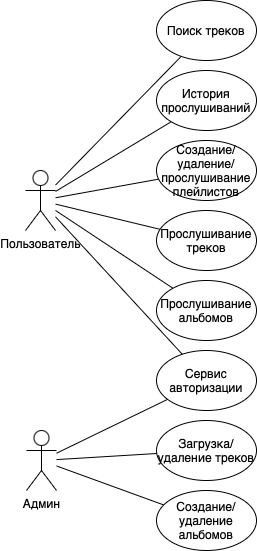
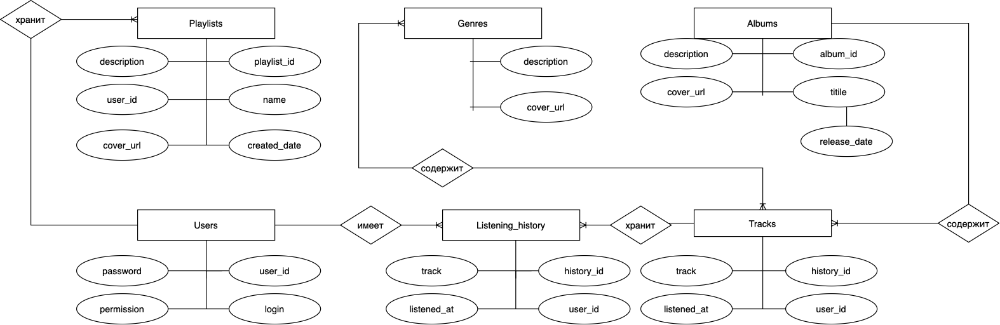
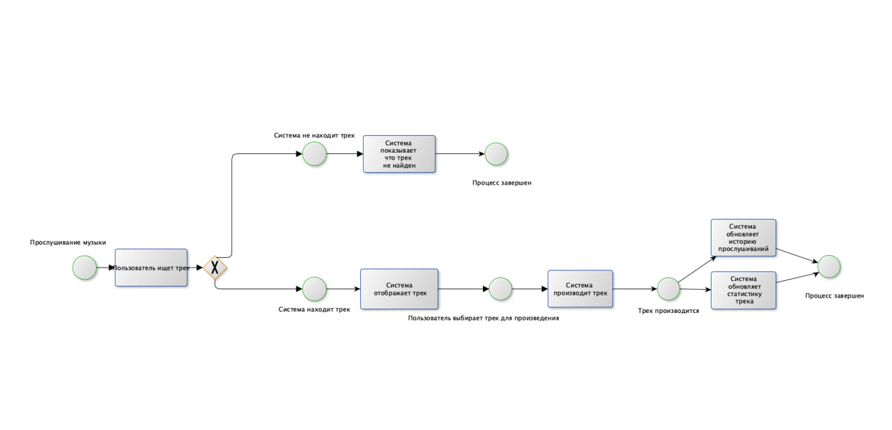

# Название проекта

Музыкальный сервис - Sonix

## Краткое описание идеи проекта

Sonix — это музыкальный сервис, позволяющий пользователям находить, слушать и организовывать музыку. Основные функции включают поиск треков по названию, артисту или жанру, создание и редактирование плейлистов, а также отслеживание истории прослушиваний.

## Краткое описание предметной области

 Музыкальный сервис работает с такими сущностями, как пользователи, треки, альбомы, жанры и плейлисты. Пользователи могут регистрироваться, искать музыку, создавать плейлисты и отслеживать свою историю прослушиваний. Артисты и альбомы связаны с треками, что позволяет организовать удобный поиск и навигацию. Жанры помогают классифицировать музыку, а плейлисты позволяют пользователям сохранять любимые треки.

## Краткий анализ аналогичных решений

| Критерий                       | Sonix | Spotify | Яндекс.Музыка | Apple Music |
|---------------------------------|-------|---------|---------------|-------------|
| Поиск музыки                    | Да    | Да      | Да            | Да          |
| Создание плейлистов             | Да    | Да      | Да            | Да          |
| История прослушиваний           | Да    | Да      | Да            | Да          |
| Бесплатная версия               | Да    | Да      | Нет            | Нет         |
| Неограниченное количество треков   | Да    | Нет     | Нет           | Нет         |
| Неограниченное количество плейлистов | Да | Нет     | Да            | Нет         |

## Краткое обоснование целесообразности и актуальности проекта

С учетом роста популярности стриминговых сервисов, создание нового музыкального сервиса является актуальным и целесообразным. 

Sonix предлагает простой и удобный способ организации и прослушивания музыки, что делает его актуальным для широкой аудитории. Проект также демонстрирует навыки работы с базами данных и проектирования сложных систем.

## Краткое описание акторов
1. Пользователь:
   - Регистрируется и аутентифицируется.
   - Ищет музыку, слушает треки, создает плейлисты.
   - Просматривает историю прослушиваний.

2. Администратор:
   - Управляет данными (добавляет/удаляет треки, альбомы).

## Use-Case - диаграмма

## ER-диаграмма сущностей

## Пользовательские сценарии

### Сценарий 1: Поиск и прослушивание трека
1. Пользователь входит в систему.
2. Вводит название трека в поисковую строку.
3. Выбирает трек из результатов поиска.
4. Нажимает "Воспроизвести".
5. Трек добавляется в историю прослушиваний.

### Сценарий 2: Создание плейлиста
1. Пользователь входит в систему.
2. Переходит в раздел "Мои плейлисты".
3. Нажимает "Создать плейлист".
4. Вводит название и описание.
5. Добавляет треки в плейлист.

### Сценарий 3: Управление данными (Администратор)
1. Администратор входит в систему.
2. Переходит в раздел "Управление данными".
3. Добавляет новый трек, указывая название, артиста, альбом и жанр.
4. Сохраняет изменения.

## Формализация ключевых бизнес-процессов

### Основной бизнес-процесс: Прослушивание музыки
1. Пользователь ищет трек.
2. Система находит трек и отображает его.
3. Пользователь воспроизводит трек.
4. Система обновляет историю прослушиваний.
5. Система обновляет статистику трека (количество прослушиваний).

